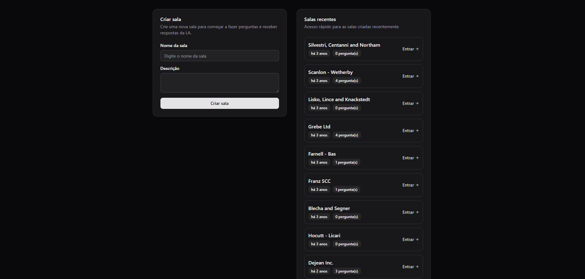
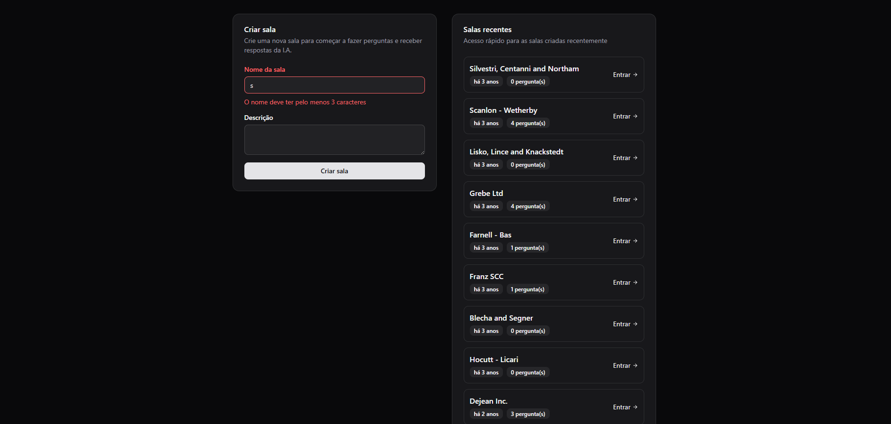
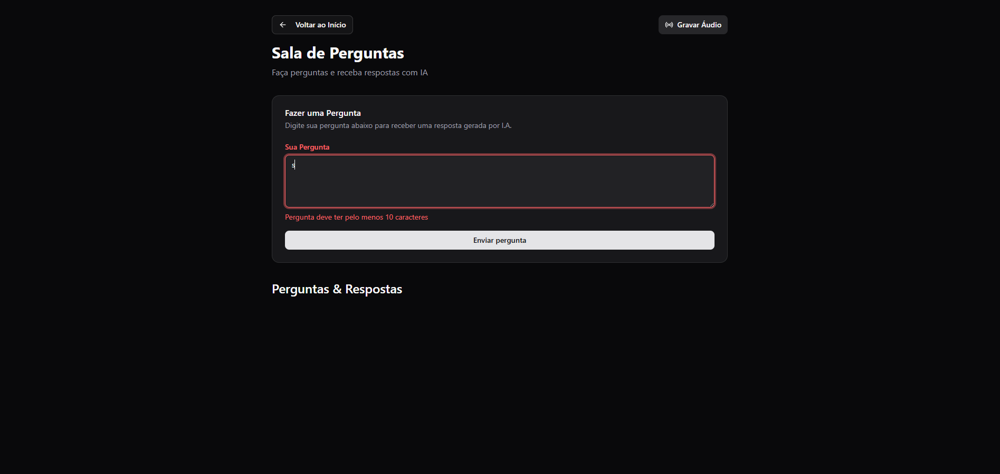
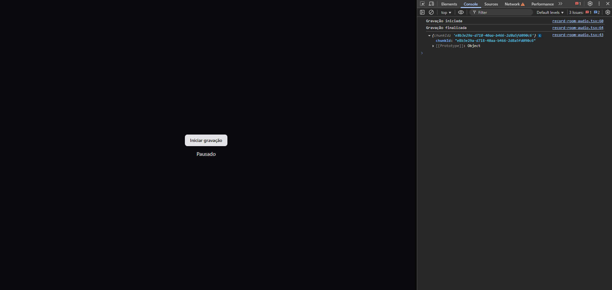

 # Live Streaming Frontend
 
 Este é o projeto frontend para uma aplicação de transmissão ao vivo, construído com React, TypeScript e Vite. Ele permite que usuários criem e participem de salas de streaming, com uma funcionalidade dedicada para gravação e envio de áudio para interação em tempo real, onde o **gemini** irá verificar as perguntas e procurar respostas adequadas, baseada em vetores (`embeddings`).
 
 ## ✨ Funcionalidades
 
 - **Criação de Salas**: Interface para criar novas salas de transmissão.
 - **Participação em Salas**: Usuários podem entrar em salas existentes através de um link.
 - **Gravação de Áudio**: Uma página dedicada permite que os participantes gravem suas contribuições de áudio.
 - **Comunicação com Backend**: Envio do áudio gravado para um serviço de backend para processamento e distribuição.
 - **Gerenciamento de Estado**: Utiliza TanStack Query (React Query) para um gerenciamento de estado de servidor eficiente e robusto.

 Abaixo se encontram imagens dos layouts da aplicação:

 

 

 

 
 
 ## 🚀 Tecnologias Utilizadas
 
 - **[React](https://react.dev/)**: Biblioteca para construir a interface de usuário.
 - **[TypeScript](https://www.typescriptlang.org/)**: Superset do JavaScript que adiciona tipagem estática.
 - **[Vite](https://vitejs.dev/)**: Ferramenta de build moderna e ultrarrápida.
 - **[React Router](https://reactrouter.com/)**: Para roteamento declarativo no lado do cliente.
 - **[TanStack Query](https://tanstack.com/query/latest)**: Para data-fetching, cache e gerenciamento de estado do servidor.
 - **[Tailwind CSS](https://tailwindcss.com/)**: Framework CSS utility-first para estilização.
 - **[Biome](https://biomejs.dev/)**: Ferramenta integrada para formatação e linting de código, garantindo qualidade e consistência.
 
 ## 🏁 Começando
 
 Siga as instruções abaixo para configurar e executar o projeto em seu ambiente local.
 
 ### Pré-requisitos
 
 - [Node.js](https://nodejs.org/) (versão 20.x ou superior)
 - [pnpm](https://pnpm.io/) (ou outro gerenciador de pacotes como npm ou yarn)
 
 ### Instalação
 
 1. Clone o repositório:
    ```bash
    git clone https://github.com/patrick-cuppi/live-streaming-frontend
    ```
 
 2. Navegue até o diretório do projeto:
    ```bash
    cd live-streaming-frontend
    ```
 
 3. Instale as dependências:
    ```bash
    pnpm install
    ```
 
 ### Executando o Projeto
 
 Para iniciar o servidor de desenvolvimento, execute o comando:
 
 ```bash
 pnpm dev
 ```
 
 O servidor será iniciado em `http://localhost:5173` (ou outra porta, se a 5173 estiver em uso).
 
 ## 🗺️ Rotas da Aplicação
 
 A aplicação é estruturada com as seguintes rotas principais, gerenciadas pelo `react-router-dom`:
 
 - **`GET /`**:
   - **Componente**: `<CreateRoom />`
   - **Descrição**: Esta é a página inicial da aplicação. Ela apresenta a interface para que o usuário possa criar uma nova sala de transmissão.
 
 - **`GET /room/:roomId`**:
   - **Componente**: `<Room />`
   - **Descrição**: A página principal da sala de transmissão. Aqui, os usuários podem assistir e interagir com o conteúdo ao vivo. O `:roomId` é um parâmetro dinâmico que identifica a sala.
 
 - **`GET /room/:roomId/audio`**:
   - **Componente**: `<RecordRoomAudio />`
   - **Descrição**: Uma página específica para participantes que desejam enviar uma contribuição de áudio. Esta rota isola a funcionalidade de gravação, permitindo uma experiência focada.
 
 ## 🎤 Fluxo de Envio de Áudio
 
 A interação por áudio é um recurso central do projeto. O fluxo de envio de uma contribuição de áudio funciona da seguinte maneira:
 
 1.  **Acesso à Página de Gravação**: O participante navega para a rota `/room/:roomId/audio`.
 2.  **Captura de Áudio**: O componente `RecordRoomAudio` utiliza a API `MediaRecorder` do navegador para solicitar permissão e gravar o áudio do microfone do usuário.
 3.  **Finalização da Gravação**: Ao finalizar a gravação, o áudio é processado e encapsulado, geralmente como um objeto `Blob`.
 4.  **Envio para o Backend**: Uma requisição (provavelmente `POST`) é feita para um endpoint do backend (ex: `/api/rooms/:roomId/audio`). O `Blob` de áudio é enviado no corpo da requisição, muitas vezes dentro de um `FormData`.
 5.  **Conexão com a Sala Principal**: Após o backend receber e processar o áudio, ele o distribui para os outros participantes na sala principal (`/room/:roomId`), permitindo que a contribuição seja ouvida por todos em tempo real.
 
 ## 🛠️ Qualidade de Código
 
 O projeto utiliza o **Biome** para garantir um código limpo, consistente e livre de erros comuns.
 
 - Para verificar formatação e erros de lint:
   ```bash
   pnpm biome:check
   ```
 
 - Para formatar todos os arquivos automaticamente:
   ```bash
   pnpm biome:format
   ```
 
 ## 🤝 Contribuindo
 
 Contribuições são bem-vindas! Sinta-se à vontade para abrir *issues* e *pull requests*.
 
 1.  Faça um *fork* do projeto.
 2.  Crie uma nova *branch* (`git checkout -b feature/sua-feature`).
 3.  Faça o *commit* de suas alterações (`git commit -m 'feat: Adiciona nova feature'`).
 4.  Faça o *push* para a *branch* (`git push origin feature/sua-feature`).
 5.  Abra um *Pull Request*.
 
 ## 📄 Licença
 
 Este projeto está sob a licença MIT. Veja o arquivo LICENSE para mais detalhes.